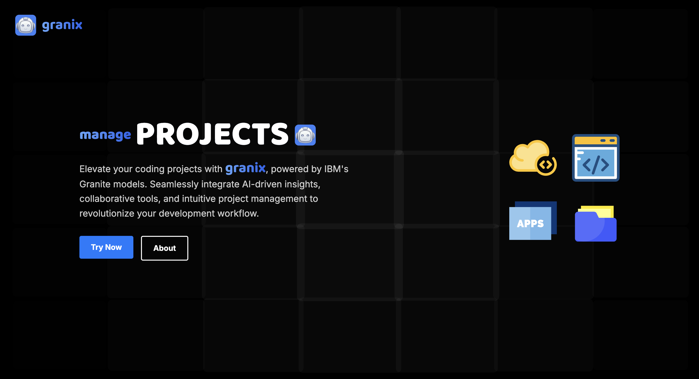

# Granix: AI-Powered Project Management



Granix is an innovative AI-powered project management platform leveraging IBM's Granite models to provide intelligent insights and streamline the software development workflow.

## Features

- **Dashboard**: Comprehensive overview of project status and key metrics.
- **Code Structure Visualization**: Interactive display of project file structure.
- **Task Management**: Intuitive interface for creating, assigning, and tracking tasks.
- **Project Management**: Tools for organizing and monitoring multiple projects.
- **AI Assistant**: Chat-based AI helper for quick project-related queries.
- **Code Assistant**: AI-powered suggestions for code-related tasks.

## Technologies Used

- **Framework**: React.js with Next.js
- **Database**: SQLite with Prisma ORM
- **AI Integration**: IBM WatsonX AI (Granite models)
- **Styling**: Tailwind CSS with custom components
- **Charts and Visualizations**: Recharts
- **Package Manager**: pnpm

## Project Overview

Granix addresses the challenges of modern software project management by integrating AI capabilities powered by IBM's Granite models. It provides developers with smarter insights, automates routine tasks, and optimizes workflows.

Key components include:

1. **Dashboard**: Centralized view of project metrics and status.
2. **Code Structure**: Visualize and navigate project file structure.
3. **Tasks**: Manage and track individual tasks within projects.
4. **Projects**: Organize and oversee multiple development projects.
5. **AI Assistant**: Get quick answers and suggestions for project-related queries.
6. **Code Assistant**: Receive AI-powered suggestions for coding tasks.

## Running the Project (For Judges)

To run Granix locally, follow these steps:

1. Clone the repository:
   ```
   git clone https://github.com/your-username/granix.git
   cd granix
   ```

2. Install dependencies using pnpm:
   ```
   pnpm install
   ```

3. Set up environment variables:
   Create a `.env.local` file in the root directory with the following content:
   ```
   WATSONX_AI_AUTH_TYPE="iam"
   WATSONX_AI_APIKEY="your_watsonx_api_key"
   NEXT_PUBLIC_WATSONX_AI_PROJECT_ID="your_watsonx_project_id"
   DATABASE_URL="file:./dev.db"
   ```
   Replace `your_watsonx_api_key` and `your_watsonx_project_id` with the provided credentials.

4. Run database migrations:
   ```
   pnpm prisma migrate dev
   ```

5. Start the development server:
   ```
   pnpm dev
   ```

6. Open [http://localhost:3000](http://localhost:3000) in your browser to view the application.

## Roadmap

Future improvements and expansions based on the current implementation:

1. **Enhanced AI Integration**:
   - Implement more sophisticated use of Granite models for code generation and task analysis.
   - Extend AI capabilities to provide more context-aware project insights.

2. **Dashboard Enhancements**:
   - Add more interactive elements and real-time updates to the dashboard.
   - Implement customizable dashboard layouts for different project needs.

3. **Code Structure Improvements**:
   - Enhance the CodeProjectStructure component with search and filter capabilities.
   - Add the ability to edit files directly within the structure view.

4. **Task Management Upgrades**:
   - Implement a more robust task dependency system in the Tasks component.
   - Add AI-powered task prioritization and effort estimation.

5. **Project Management Features**:
   - Develop tools for resource allocation across multiple projects.
   - Implement AI-driven project health assessments and recommendations.

6. **AI Assistant Advancements**:
   - Enhance the AIAssistant component with more project-specific knowledge.
   - Implement a learning mechanism to improve AI responses over time.

7. **Code Assistant Expansion**:
   - Extend the code assistant to support more programming languages and frameworks.
   - Implement AI-powered code refactoring suggestions.

8. **Performance Optimization**:
   - Implement server-side rendering for faster initial page loads.
   - Optimize database queries for improved response times, especially for large projects.

9. **Integration Capabilities**:
   - Create APIs for integration with popular version control systems.
   - Implement data import/export features for project migration.

10. **User Experience Improvements**:
    - Refine the UI for better accessibility and responsiveness.
    - Implement dark mode and customizable themes.

## Contact

This project was developed by Patrick Camara. For any inquiries, please contact: greentopyellow@gmail.com

---

Granix - Elevating Project Management with AI